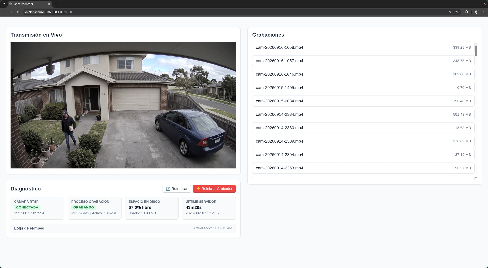

# Cam Recorder

Cam Recorder is a software tool to record video from a Tapo C200 camera. It runs as an OpenRC service on Alpine Linux.



## System requirements

You must have these items to operate this software:

- Alpine Linux v3.24 x86_64.
- An AMD GPU with VA-API support (for example, AMD Lucienne).
- Go (to compile the software).
- FFmpeg (to record and to transcode video).

## Installation

First clone this repo:

```shell
git clone https://github.com/franelfers/cam-recorder
```

### Option 1: Install for your user (no root)

1. Build the installer package:
   ```shell
   make installer
   ```
2. Run the generated installer script as your normal user (not with `sudo`):
   ```shell
   ./cam-recorder-install.sh
   ```
   It installs the binary in `~/.local/bin`, the web page and recordings in `~/.local/share/cam-recorder`, and the configuration in `~/.config/cam-recorder`. Then it asks if you want to enable the OpenRC service at boot. Only that step asks for your `sudo` password, because it writes `/etc/init.d/cam-recorder`. The service runs as your user and reads your configuration. Your user must be in the `video` group to use hardware acceleration.
3. Edit `~/.config/cam-recorder/config.json` (no `sudo` needed), then start or restart the service (`sudo` needed):
   ```shell
   sudo rc-service cam-recorder start
   sudo rc-service cam-recorder restart
   ```
   Without the service, run `cd ~/.local/share/cam-recorder && ~/.local/bin/cam-recorder` directly.
4. To remove the installation, run the uninstaller that `make installer` also generates. It asks if you want to stop and disable the service (`sudo` needed). The configuration and recordings are kept:
   ```shell
   ./cam-recorder-uninstall.sh
   ```
5. Open a web browser and visit `http://<server-ip>:8080/`.

### Option 2: Run directly without installation

1. Build the binary:
   ```shell
   make build
   ```
2. Run the executable from the project directory:
   ```shell
   ./cam-recorder
   ```
3. Open a web browser and visit `http://localhost:8080/` (or use the configured IP address and port).

## Configuration

The software reads its settings from `~/.config/cam-recorder/config.json` (or `$XDG_CONFIG_HOME/cam-recorder/config.json`). Copy the `config.json` from this repository as a starting point:

```shell
mkdir -p ~/.config/cam-recorder && cp config.json ~/.config/cam-recorder/
```

| Config             | Description                                                                                                               |
| ------------------ | ------------------------------------------------------------------------------------------------------------------------- |
| `rtsp_url`         | URL of the camera RTSP stream                                                                                             |
| `output_dir`       | Directory to save the MP4 video files                                                                                     |
| `hls_output_dir`   | Directory to save the temporary HLS stream files                                                                          |
| `disk_limit_pct`   | Minimum free disk space percentage. If the free space is less than this value, the software deletes the oldest video file |
| `video_duration`   | Length of each video file in seconds                                                                                      |
| `compression_days` | Number of days before the software compresses a video file to the H.265 format                                            |
| `retention_days`   | Number of days before the software deletes a video file                                                                   |
| `port`             | Network port for the web interface                                                                                        |
| `hwaccel_device`   | Device path for hardware acceleration (for example, `/dev/dri/renderD128`)                                                |

## Web interface features

- **Watch live video**: Transcodes the RTSP stream to HLS on demand when you view the page.
- **Diagnose issues**: Shows real-time status of the RTSP camera connection, the FFmpeg recording process, disk space, and server uptime.
- **Inspect logs**: Expand the log viewer to see recent FFmpeg output and errors.
- **Restart the recorder**: Restart the FFmpeg recording process directly from the browser.
- **Play recordings**: Select and watch recorded MP4 files in the browser.
- **Download recordings**: Download recorded files to your computer.

## Maintenance tasks

The software does these tasks automatically every hour:

- It compresses old video files to use less disk space.
- It deletes video files that are older than the retention limit.
- It deletes the oldest video files if the free disk space is too low.

## API endpoints

- `GET /`: The main web page.
- `GET /videos`: JSON list of recorded MP4 files.
- `GET /download/<file>`: Downloads a recorded file.
- `GET /hls/stream.m3u8`: The live HLS video playlist.
- `GET /api/keepalive`: Keeps the live HLS stream running while viewers are active.
- `GET /api/stats`: Basic system statistics (uptime, disk space).
- `GET /api/diagnostics`: Detailed diagnostics (camera connectivity, recorder state, logs).
- `POST /api/recording/restart`: Restarts the FFmpeg recording process.

## Service logs

- Standard messages: `/var/log/cam-recorder.log`
- Error messages: `/var/log/cam-recorder.err`

To see live error messages, use this command:

```shell
tail -f /var/log/cam-recorder.err
```
